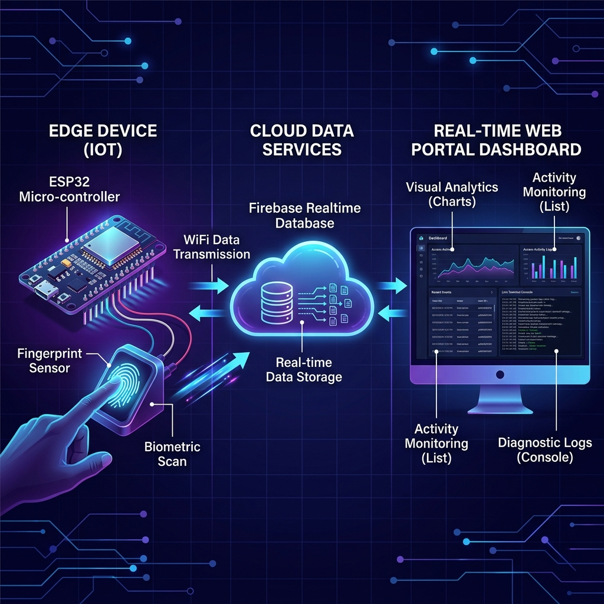
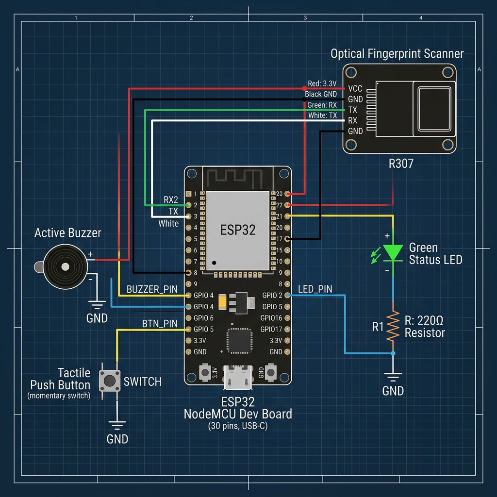

# 🟢 BioSync: IoT Fingerprint Attendance System

[](https://www.espressif.com/en/products/socs/esp32)
[](https://firebase.google.com/)
[](https://react.dev/)
[](https://vitejs.dev/)

**BioSync** is an enterprise-grade IoT fingerprint check-in and attendance logging ecosystem. It bridges an ESP32 micro-controller board (connected to an optical fingerprint scanner) with a modern admin portal web application via low-latency Firebase Realtime Database handshakes.

---

## 🌐 System Architecture & Workflow

The system maintains real-time, bi-directional event loops bridging physical hardware with browser clients:



1. **Check-In Event Loop:** Fingerprint is scanned $\rightarrow$ matched template confidence verified against security settings $\rightarrow$ check-in logged to Firebase $\rightarrow$ web page updates immediately $\rightarrow$ ESP32 triggers dynamic buzzer sounds & status LED beeps.
2. **Remote Enrollment Handshake:** Admin clicks "Enroll" in the web UI $\rightarrow$ writes ID to `/settings/enroll_id` $\rightarrow$ ESP32 pulls the command, lights up, and launches the scan sequence $\rightarrow$ scan step statuses (`place finger`, `lift`, `match success`) stream live to a web modal wizard.
3. **Remote Deletion Handshake:** Admin deletes student profile $\rightarrow$ publishes target ID to `/settings/delete_id` $\rightarrow$ ESP32 triggers hardware cleanup to erase the template model from the scanner sensor's EEPROM.
4. **Live System Logs Console:** ESP32 console printouts (WiFi connection status, NTP sync steps, boot status, database writes, scan confidence scores) are written to Firebase and rendered live in a scrolling dashboard terminal console.

---

## ⚡ Key Features

* **Premium Glassmorphic UI/UX:** Responsive dashboard designed with vanilla CSS variables, glowing indicators, layout animations, and dark cyber-indigo theme variables.
* **Dynamic Settings Synchronizer:** Modify match sensitivity matching thresholds, audible beep durations, or mute feedback directly on the settings page. The ESP32 pulls and applies these parameters in the background every 30 seconds.
* **NTP Clock Sync Protection:** ESP32 syncs local time via NTP server on boot to prevent SSL handshake exceptions when querying Firebase database endpoints.
* **Attendance Ledger Analysis:** Aggregates attendance statistics (Working Days, Average Check-in rates, Top Performers) dynamically, with a single-click CSV ledger export tool.

---

## 🔌 Hardware Wiring Schematic

The ESP32 interfaces with an R307 fingerprint sensor, active buzzer, status LED, and tactile push button. 



### Pin-Out Connections Table

| Component | Pin Type | ESP32 GPIO | Connection Notes |
| :--- | :--- | :--- | :--- |
| **R307 Sensor** | VCC | **3.3V / 5V** | Power supply (usually 3.3V is safe). |
| **R307 Sensor** | GND | **GND** | Ground reference connection. |
| **R307 Sensor** | TX (Green/Yellow) | **RX2 (GPIO 16)** | Cross-connects to ESP32 UART RX. |
| **R307 Sensor** | RX (White) | **TX2 (GPIO 17)** | Cross-connects to ESP32 UART TX. |
| **Green LED** | Anode (+) | **GPIO 2** | Connection through 220Ω resistor. |
| **Green LED** | Cathode (-) | **GND** | Ground leg. |
| **Buzzer** | Positive (+) | **GPIO 4** | Active buzzer positive feed pin. |
| **Buzzer** | Negative (-) | **GND** | Ground connection. |
| **Push Button** | Terminal A | **GPIO 5** | Triggers manual local enrollment mode on click. |
| **Push Button** | Terminal B | **GND** | Pulls Pin 5 to ground when pressed. |

---

## 🚀 Setup & Installation

### 1. Firebase Setup
1. Create a Firebase project and provision a **Realtime Database** (Singapore `asia-southeast1` region recommended).
2. Go to **Project Settings** $\rightarrow$ **Service Accounts** and create a Web App to get your configuration parameters.
3. Configure your database rules to allow read/write access:
   ```json
   {
     "rules": {
       ".read": "auth != null",
       ".write": "auth != null"
     }
   }
   ```
   *(For developer sandbox testing, you may set them to `true` momentarily).*

### 2. ESP32 Firmware Installation
1. Open the [ESP32/ESP32.ino](./ESP32/ESP32.ino) file inside the Arduino IDE.
2. Install the following libraries in Arduino Library Manager:
   * `Firebase ESP32 Client` (by Mobizt)
   * `Adafruit Fingerprint Sensor Library`
3. Edit [ESP32/config.h](./ESP32/config.h) to fill in your credentials:
   ```cpp
   #define WIFI_SSID "your_wifi_name"
   #define WIFI_PASSWORD "your_wifi_password"
   #define API_KEY "your_firebase_api_key"
   #define DATABASE_URL "https://your-project-default-rtdb.asia-southeast1.firebasedatabase.app/"
   #define USER_EMAIL "your_firebase_auth_user@mail.com"
   #define USER_PASSWORD "your_firebase_auth_password"
   ```
4. Build and upload the sketch to your ESP32 board.

### 3. React Web Application Setup
1. Navigate to the `Website` directory:
   ```bash
   cd Website
   ```
2. Install dependencies:
   ```bash
   npm install
   ```
3. Edit `src/firebaseConfig.js` to insert your Web App Firebase config credentials:
   ```javascript
   const firebaseConfig = {
     apiKey: "your_api_key",
     authDomain: "your_auth_domain",
     databaseURL: "https://your-project-default-rtdb.asia-southeast1.firebasedatabase.app/",
     projectId: "your_project_id",
     storageBucket: "your_storage_bucket",
     messagingSenderId: "your_sender_id",
     appId: "your_app_id"
   };
   ```
4. Run the local development server:
   ```bash
   npm run dev
   ```
5. Build for production:
   ```bash
   npm run build
   ```
